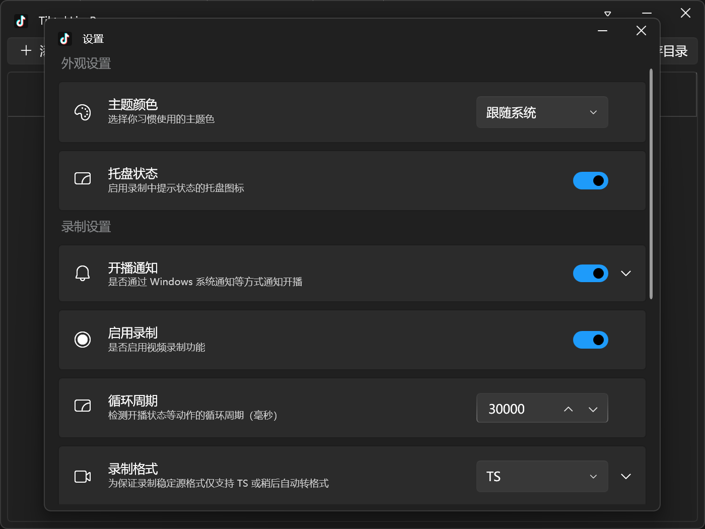

[English](README.md) | [简体中文](README.zh-Hans.md)


# 抖音直播录制

[](https://github.com/emako/TiktokLiveRec/blob/master/LICENSE) [](https://github.com/emako/TiktokLiveRec/actions/workflows/library.nuget.yml) [](https://dotnet.microsoft.com/en-us/download/dotnet/latest/runtime)

具有用户界面、无人值守操作和直播流录制功能。

实现基于 FFmpeg 以及 FFplay。

## 截图



## 依赖运行时

For Windows: [.NET Desktop Runtime 8.0](https://dotnet.microsoft.com/en-us/download/dotnet/8.0)

For Others: [.NET Runtime 8.0](https://dotnet.microsoft.com/en-us/download/dotnet/8.0)

## 直播录制

支持以下直播平台

| 平台              | 状态   |
| ----------------- | ------ |
| Douyin (中国抖音) | 支持   |
| Tiktok (海外抖音) | 待开发 |

怎么添加直播间：

```bash
# 直播间链接类似如下：
https://live.douyin.com/XXX
```

## 支持系统

为了加快初版开发实现，首版基于 WPF 开发了 Windows 版本。

其他系统的实现会基于我个人需求或其他用户的反响。

另外 macOS 估计会是下一个支持的系统。

| 操作系统 | 开发框架          | 状态   |
| -------- | ----------------- | ------ |
| Windows  | WPF               | 支持   |
| macOS    | Avalonia          | 待开发 |
| Ubuntu   | Avalonia/WPF+Wice | 待开发 |

## 隐私政策

[查看隐私政策](PrivacyPolicy.zh-Hans.md)。

## 许可证

本项目基于 [MIT 许可证](LICENSE)。

## 鸣谢

为了节约后续维护成本，直接参考了部分来自 [DouyinLiveRecorder](https://github.com/ihmily/DouyinLiveRecorder) 的字符串数据比如正则表达式。