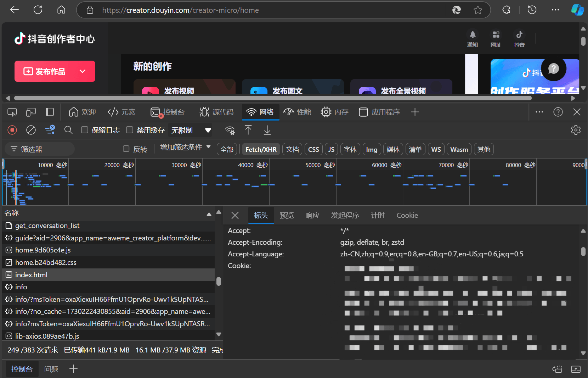

#### 抖音 Cookie 获取

1. 点击 [抖音创作服务平台](https://creator.douyin.com/creator-micro/home) 登录后进入首页；

2. 按下 `F12` 打开检查页面后，按下 `F5` 刷新当前页面；

3. 先在第一行菜单栏中点击 `网络` 后，在第三行菜单栏中点击 `XHR` 选择；

4. 在下方的响应列表中找到名称为 `index.html` 的响应，单击打开；

5. 在 `标头` 栏向下滑动至请求标头，在请求标头中找到 `Cookie` 并将对应的值复制至工具中即可。

