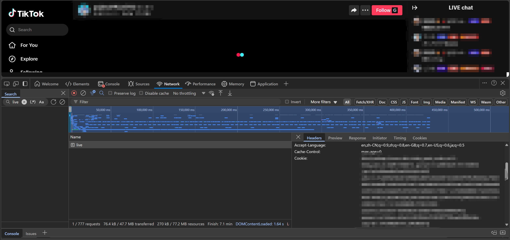

#### How to get your own Cookie from Tiktok Live?

1. Go to the Live URL such as https://www.tiktok.com/@xxx/live and logging in is recommended, but not required.
2. Press `F12` to open the Developer tools and then press `F5` to refresh the page.
3. Click to `Network` page, and select the earliest small part of the timeline to quickly find `live`.
4. You can find your `Cookie` from `Headers` label.

